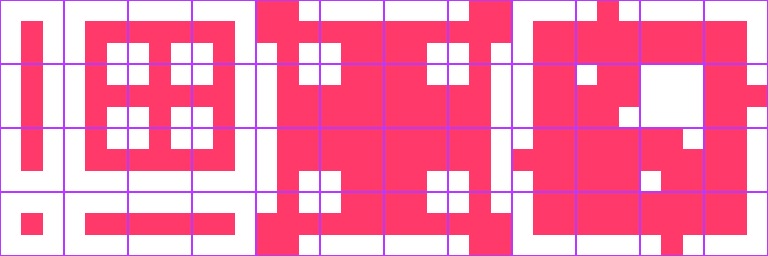
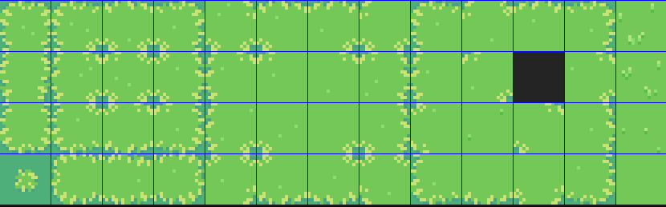
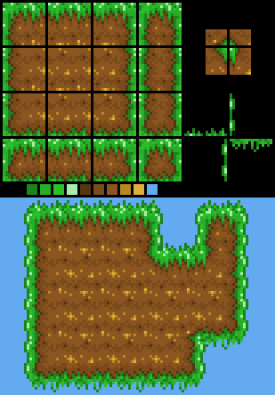
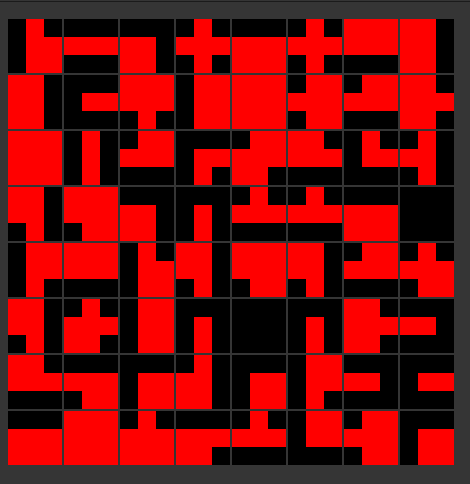
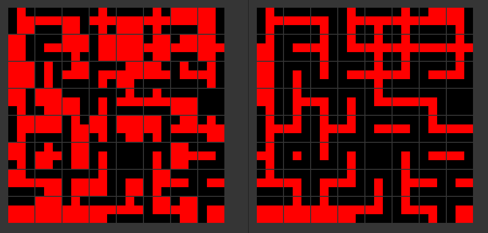
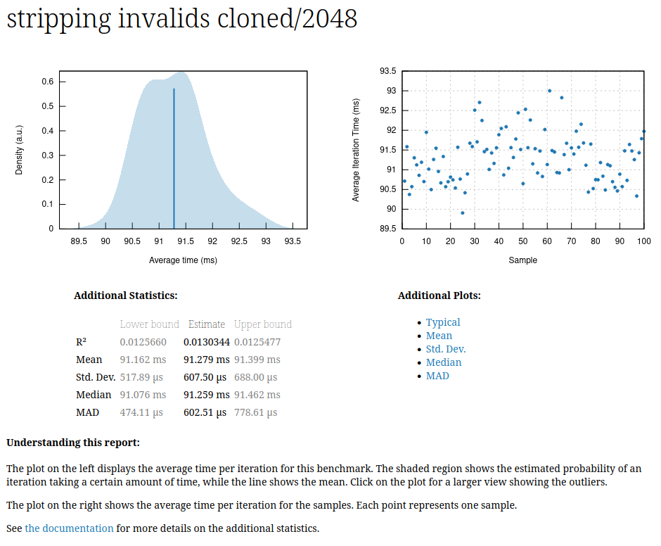
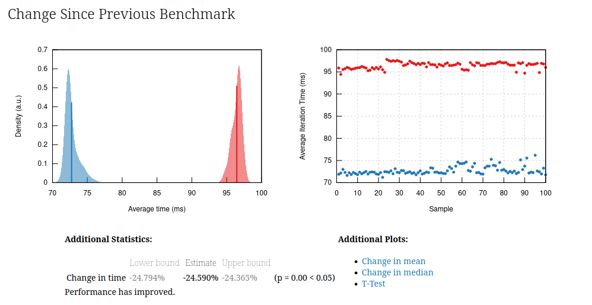
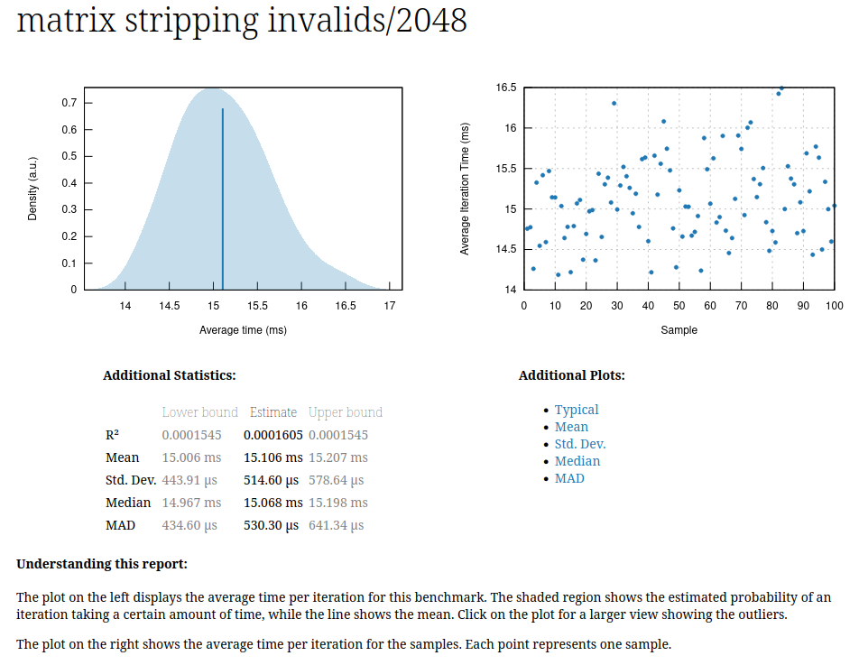

# Rust Auto Tiler

## The Project

This project exists to optimize a 3x3 auto-tiling algorithm. I found I had an interest in this problem after
encountering issues with the Godot 4.0 beta's auto-tiler. It's behavior was incorrect in some cases, and it had terrible
performance. I intended to provide a patch which solved it. But the problem was only for the 3x3 auto-tiler, but found
that their implementation was a bit of a brick wall. To modify it, I would have had to rewrite too much, and it wouldn't
have been worth the time. The Godot auto tiler also supported 2x2, hexagonal and 3d tiling methods, none of which I had
any interest of contributing to at the time.

But now I'm going to use this toy problem to work on my optimization skills in Rust. The problem has a side effect of
being potentially useful, which helps.

## The 3x3 auto tiling algorithm

A tile is a 3x3 grid of boolean values. There are a subset of the possible 2^9 combinations which are useful tiles for
game programmers to actually use. They are conveniently enumerated in this single reference image.

(with real art)

When designing levels, game developers need to ensure that the correct tile is selected which joins nicely with its
neighbours. So as they are adding tiles to a scene, they need to select the specific tile from the reference and place
them one-by-one.

This would be extremely tedious, if *auto-tilers* didn't exist. The job of an auto-tiler is to automatically select a
tile for you, based on the tile's neighbours.

## Features

There are two modes of painting tiles with an auto-tiler, plus an erase mode.

- Path Mode: Connect one tile to another (point-to-point) without modifying other tiles.
- Fill Mode: Add a tile so that it merges into a continuous blob with all it's neighbours.
- Erase Mode: Remove a tile and re-evaluate the tile's neighbours.

I have a few approaches I can take. My initial idea is a simple rules based system. 'If this pixel and that pixel are
on, then this other pixel should be on.' Simple.

## Optimizations

First, I need a tileset. I could hard-code the reference 3x3 tileset as a massive boolean array, but seeing as I don't
want to put myself through hard-coding 432 bits, I wrote an image parser. Then I wanted to verify my parser by eye, so
I imported GTK and built a simple image viewer GUI to display the pixel grid. Everything worked first try anyway, so on
to the actual problem!

I started generating grids of random tiles, from 1x1 up to size 2048x2048. These grids are nearly 99% invalidly placed
garbage.

This sort of invalid grid should basically never exist in real world use-cases. What I want is the grid to be valid
before modification in my tests. So I need to write an algorithm to clean up the grid and make it valid.

## Stripping Invalids

I wrote an algorithm that strips away all invalidly placed pixels. Invalid pixels are easy to spot, as they don't
form valid connections with their neighbours.

This algorithm operates over the whole grid, so why not start here with my optimizations. Initially the algorithm took
90ms, as shown by the extremely handy charts generated by the criterion benchmarking framework.

At this point, I wanted to see how much performance could be gained without actually changing the core algorithm.

### In-Place or Clone

It's more idiomatic Rust, and more functional, for the grid to be immutable, and to clone it and work on the clone.
But that requires twice the memory and allocating 2048x2048 bools is 4.2MB, which is pretty significant.

However, I want to reserve work-in-place optimizations for last as it blocks potential for compiler optimizations and
parallelization.

### Compacted Bit-Vec (bit manipulation)

I tried a bit-vec approach, where each bit is compressed in an unsigned 16 bit integer type, but while very compact,
it's
actually not more performant.

A compacted bit-vec is slower than a sequence of booleans because working with an array of booleans is just a load or
store operation, the pointer offset can be computed in one instruction with `lea`. Whereas with the bit vec, a series of
shifts and masks need to be applied.

In this case, the use of bit-vectors also disqualifies the compiler vectorization of our data, as loop iterations have
data dependencies which cannot be safely ignored.

### `Vec<Vec<T>>` or `Vec<T>` & Math

I want to keep all the memory in a pretty contiguous chunk to maximize cache hits. A `Vec<<Vec<T>>` should be ok, but a
`Vec<T>` with some indexing math `(y / w + x % w)` should be even better for cache hits, but then we incur the cost of
the indexing math.

Anyway, I tried both, and it turns out they perform about the same... until I removed the modulo operation on `x`, which
resulted in a 25% improvement from ~95ms to ~70ms.

### Threading (The good stuff)

With large grids like 2048x2048, the clear bottleneck is CPU time. But so far I've only been using one CPU (core). It's
about time to start parallelizing the algorithm. My simple approach is to feed each thread a set of rows that they're
responsible for working on. Since we're using a `Vec<T>`, I can take a slice of the vec, and it will be also be the
contiguous memory for a row of the grid. Then I can send that slice to a worker thread, and they won't have any
overlapping writes. They all read from the same immutable grid and write to a clone of that grid. *This* is why I didn't
dive any deeper into modify in-place approach.

The performance gain is huge. From 70ms to **15ms**.

From my original time of 95ms, that's an 85% increase in
performance *without even changing the algorithm*.